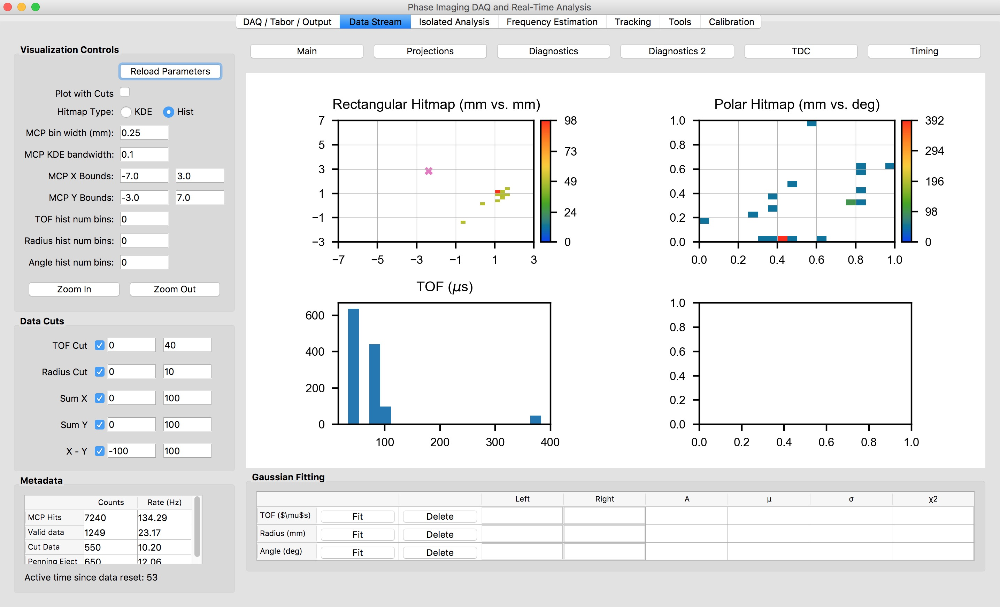
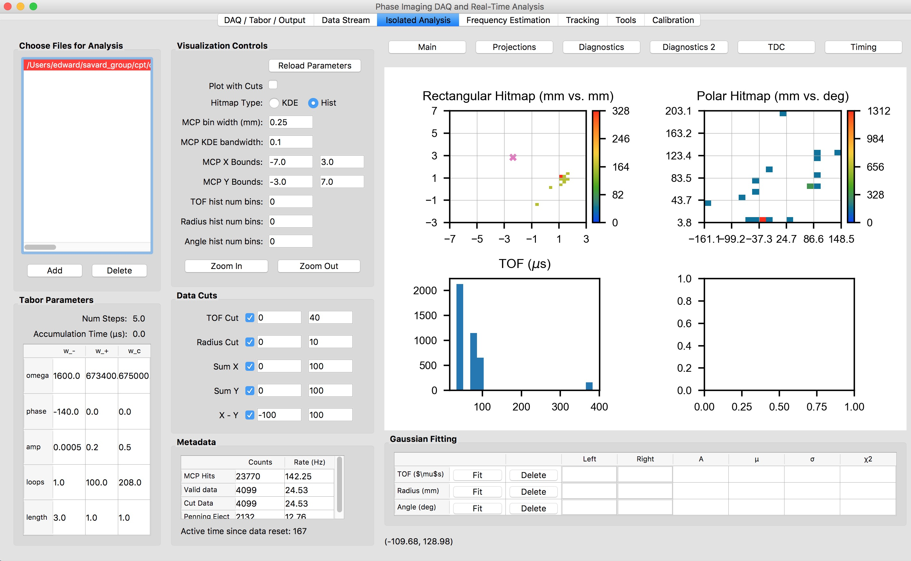
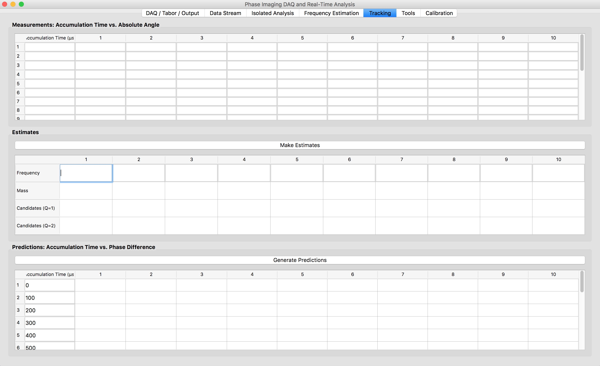
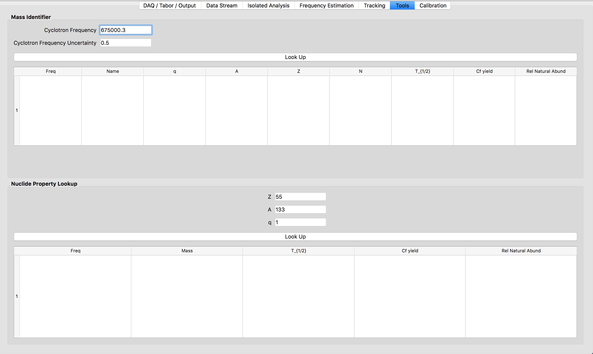

# CPT Control System User Guide 

## Overview

This is a complete guide for functionality provided by the system, without going into the software implementation. If you want to make changes to the system, read this before the programming guide.

## DAQ / Tabor / Output 

The Tabor is the RF pulse generator that applies excitations to the CPT electrodes. You can set the Tabor pulse parameters by typing them into the table and text fields and then clicking on the button labeled **Load Tabor Parameters**. The default action is to save the current data collected and clear it whenever loading new Tabor parameters. This behavior can be changed by selecting or unselecting one of the two checkboxes above **Load Tabor Params**. 

To set the cyclotron frequency from current calibration data and the AME mass table, enter the Z, A, and charge of the nuclide of interest, then click on __Set Params from Ion Data__. This will also keep w\_i the same as its previous value and set w\_+ so that w\_- + w\_+ = w\_c. This same entry is used to set the analysis ion data for a preliminary frequency estimate using AME masses. If you want to set the analysis data without changing the currently set pulse cyclotron frequency, use the button **Set Analysis Ion Data**.

To pause the TDC data collection, click on the button **Running**. The button will change color to red and the text will change from "Running" to "Paused". Data collection will then resume if you click the same button again. When paused and resumed, the data will not reset. To clear the current data, click on **Clear**. 

To save the data, click on **Save**. If you specify a name in **Alternate Name**, then data will be saved in the default save directory under `data/<alternate_name/>`. Otherwise, the data will be saved under the element name set by either of the two **Set Ion Data** buttons. For example, if Z=55 and A=133 are set, then the data will be saved under `data/133Cs/`. If no alternate name is set and the ion parameters are also not set, then the data will be saved under `data/unknown_ion/`. 

When the data is saved, the file name will have a time stamp which corresponds to _when the data started being recorded_. That means that if you save data twice without clearing it or resetting the Tabor parameters, the data will be overwritten since the previous data saved is a subset of the new data. If you clear the data or load Tabor parameters, then a new timestamp will be started.

To save a comment to the user comment log, type your name in **Experimenter** and a note in **Session Comments**, then click on **Save Comment**. The comment will then be cleared afterward so that you can save another one if necessary. **Save Comment** is automatically clicked whenever **Save** is clicked. 

The **Metadata** box shows the counts and rates for the following data: 

* **MCP hits**: total number of hits on the TDC channel corresponding to the TDC. This includes hits where hits on the other delay channels were recorded. Thus, this gives a measure of noise in the detector. 
* **Valid data**: the total number of events that were able to be grouped, so events where a hit was recorded on the MCP channel and all 4 delay lines before another MCP hit occurred. This number is less than or equal to the number of MCP hits.
* **Cut data**: number of events satisfying the current cuts that are set in the **Data Stream** tab. This is less than or equal to the number of **Valid data**.
* **Penning Eject**: Number of TDC hits on the channel corresponding to the Penning trap eject pulse, which ejects the trapped ions toward the detector.

If you want to run a sequence of data acquisitions where the only change is the accumulation time, type in the sequence of desired accumulation times in the table under the box **Batch Instructions**. Set a stopping criterion for each acquisition in the text fields **Stop Time** or **Stop Counts**. Stop counts checks the number of data that meet the currently specified cuts set in **Data Stream** (discussed later). Only one stopping criterion is needed, and if both are specified, then whichever criterion is met first will terminate that data collection. Once you click **Start Batch**, the program will load the Tabor parameters for each of the initially specified accumulation times and save the data once the stopping condition is met. The current design is that if you change the accumulation times after the batch has started, this change will not be recognized. You can generate linearly spaced data using the **Generate Linspace** button.

## Data Stream 

This displays plots of the data currently being taken. You can change some of the plotting parameters in the 'Visualization Controls' section. This includes the following:

* **Plot with Cuts**: toggle whether the data is that which satisfies the cuts, or all events for which an event was recorded on all 4 delay lines. 
* **Hitmap type**: keep this on Hist. If it is set to KDE, a kernel density estimation will be applied to the data. This is a very slow process and not appropriate for live-streaming in the current implementation. It can be more appropriately used in **Isolated Analysis**.
* **MCP bin width**: width of the bins in the rectangular hitmap
* **MCP KDE bandwidth**: bandwidth for the KDE computation. Only is used if Hitmap type is set to KDE. 
* **MCP X and Y Bounds**: bounds of the rectangular hitmap. Zoom in / out buttons are more useful.
* **TOF / Radius / Angle hist num bins**: number of bins in those histograms. If set to 0, the number of bins will automatically be computed with an OK value. 
* **Zoom in / out**: increment MCP rectangular hitmap X and Y bounds by 2.5 in either direction. Will issue a warning in the console if you try to zoom in more than possible, but will not give an error.

In addition, you can set data cuts in the **Data Cuts** box. If the checkbox is selected, then the cut will be applied, otherwise it will be ignored. The first and second boxes are respectively the lower and upper bound for each parameter. 

If any of the parameters are changed, including both the visualization parameters and data cuts, then click on **Reload Parameters** to refresh. In some cases, this button is automatically clicked, such as zoom in / out, plot with cuts, hitmap type.

## Isolated Analysis

This is the same as the data stream, except it is made for loading previously saved data rather than streaming the current data. To add data to the session, click on the **Add** button under **Choose Files for Analysis**. Then select a .lmf or .cpt file. The plots will all be loaded and the tabor parameters that were set during that data acquisition (unless it is a .lmf file) will be displayed. The visualization controls and cuts are all the same as in the Data Stream tab. You can remove the data using the **Delete** button. To browse multiple data that have been added, click on the file name in the **Choose files for analysis** box and the current actively displayed data will be set to the data in the file clicked.

## Frequency Estimation

Not currently used. 

## Tracking Tab

Not currently implemented. 

## Tools Tab

This provides two tools that are useful for analysis. The first is the **mass identifier**, which can be used offline as well. Type in a measured cyclotron frequency, an error estimate for the frequency, and click **Look up**. This will print data to the console for potential matches for all charge states to the specified frequency within the confidence interval supplied. 

In Nuclide Property Lookup, you can type in a nuclide's Z and A to see the nuclide's properties.

## Calibration Tab

If you wanted to non-permanently change the MPC center coordinates being used just for the current data session, you can do that here. You may want to do that if analyzing old data that was taken when then MCP center coordinates were different from the current ones. You can also update the calibrant used for analysis here, which you may want to do if making a precision mass measurement for a mass number far from 133. 

## Configs

There are a few different configs which are used for different purposes. They are the following: 

* `cpt_tools/cpt_tools/cpt_config.py`: here is where the default calibration nuclide and frequency are set, as well as the MCP center coordinates.
* `cpt_tools/gui_controller/gui_helpers/gui_config.py`: this is where the default tabor settings, cut settings, and global includes for all the GUI modules are set.
* `cpt_tools/controller_config.py`: set whether to connect to TDC and Tabor, as well as a few GUI parameters. `USE_FAKE_DATA` will create a fake TDC data stream. That is what I used for developing the software off of the CPT computer. `USE_TABOR` will automatically be set to 0 if not using a Windows computer. IF `USE_TDC` is set to 0, then there will be no data stream, either real or fake. This mode is well suited for offline analysis.

## Common problems
The following error message occurs if the coomputer is unable to connect to the TDC: 
	
	ERROR: DeviceOpen: Failed opening a handle to the device: Failed opening a WDC device handle. Error 0x2000000e - Resource overlap

This error will happen if the TDC is already connected to another program. The most common cause would be that CoboldPC is running and connected to the TDC when you try to start the program. It is possible to keep Cobold open for offline analysis. You can also connect to the TDC via Cobold for real-time analysis, stop data acquisition on Cobold via the command `stop`, and then should be able to connect to the TDC via the cpt control system. The error above would also occur if you tried to launch the phase imaging GUI twice.

When you first start the program, the program will not have any knowledge of what the Tabor parameters are. You have to set the Tabor parameters at least once for the program to track the parameters, which is required to save data.

## Console Error Messages

The following occurs during plotting if data with 0 events is plotted, and is not a problem: 

	/Users/edward/Library/Enthought/Canopy/edm/envs/User/lib/python3.5/site-packages/matplotlib/colorbar.py:890: RuntimeWarning: invalid value encountered in true_divide
	z = np.take(y, i0) + (xn - np.take(b, i0)) * dy / db

## Known bugs 

If you find a bug, see if you can find the specific input that triggered it. Be sure to copy or take a picture of the error messages produced in the console.

## Contact
Jacob Pierce, Sep 2017 – Sep 2018: initially developed system 

Dwaipayan Ray: first PhD student to test system